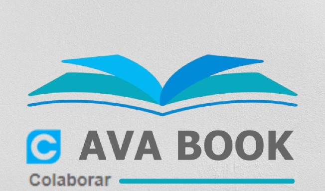
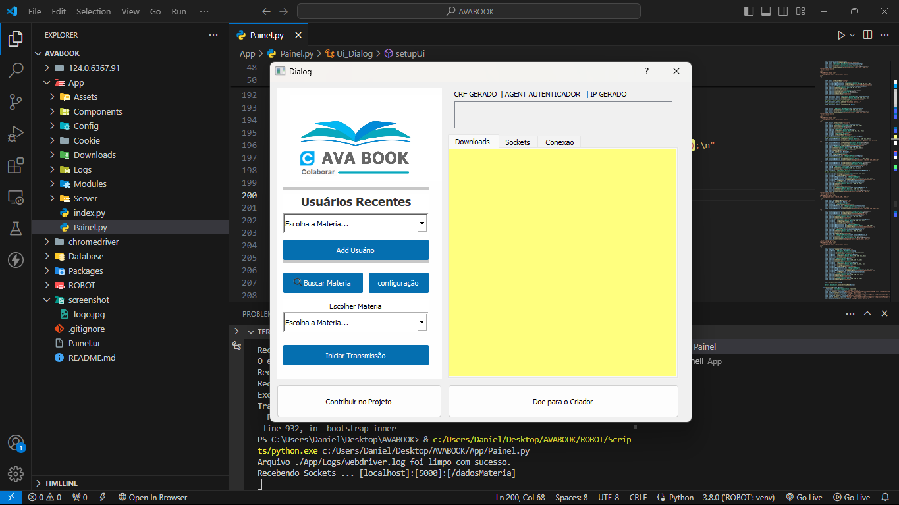
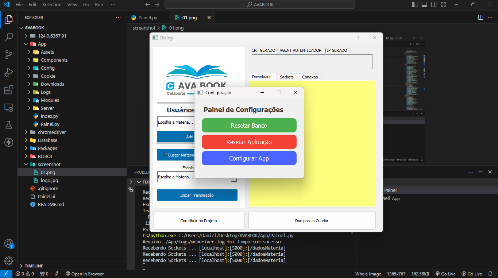
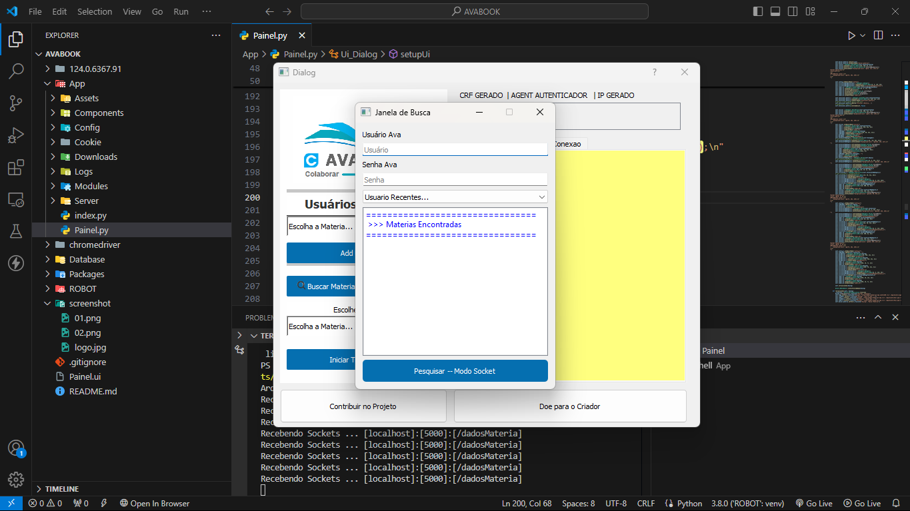
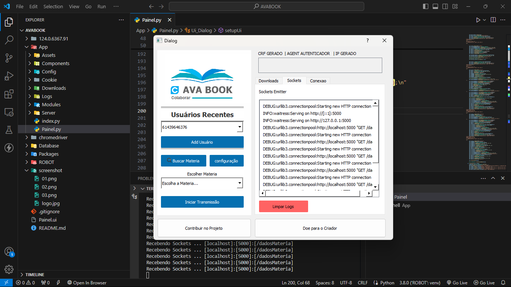

# AvaBook

    

## Descrição do Projeto
------------------------

O AvaBook é um software desenvolvido para automatizar o processo de download, compressão e geração de livros em formato PDF e HTML estático. Foi criado como um projeto acadêmico para a faculdade, com o objetivo de simplificar e agilizar o acesso a materiais de estudo.

## Finalidades
--------------

*   **Automatização de tarefas repetitivas**: O AvaBook visa reduzir o tempo e o esforço necessário para realizar tarefas rotineiras, como baixar e comprimir livros.
*   **Melhoria da segurança**: Ao automatizar o processo de download e compressão, o AvaBook minimiza a exposição a riscos de segurança associados ao download manual de arquivos.
*   **Geração de formatos de arquivo**: O software gera livros em formato PDF e HTML estático, facilitando a leitura e o compartilhamento de conteúdo.

## Características
-------------------

*   **Download automático de livros**: O AvaBook baixa livros de fontes pré-configuradas, eliminando a necessidade de intervenção manual.
*   **Compressão automática**: O software comprime os livros baixados, reduzindo o tamanho do arquivo e facilitando o armazenamento e compartilhamento.
*   **Geração de PDF e HTML estático**: O AvaBook converte os livros em formato PDF e HTML estático, permitindo a leitura em diferentes dispositivos e plataformas.
*   **Interface de usuário intuitiva**: O software oferece uma interface de usuário fácil de usar, permitindo que os usuários configurem as opções de download e compressão de acordo com suas necessidades.

## Para Fazer funcionar O AVABOOK você Precisa
voce precisa  Baixar a DLL e colocar na pasta 124.0....

Endereço pra Baixar : [https://github.com/dvizioon/VIZIOON-AVABOOK/releases/tag/BAIXAR_SEFRO_MOTOR](https://github.com/dvizioon/VIZIOON-AVABOOK/releases/tag/BAIXAR_SEFRO_MOTOR)

## Requisitos do Sistema
-------------------------

*   **Sistema operacional**: Windows, macOS ou Linux
*   **Linguagem de programação**: Python 3.11
*   **Bibliotecas e frameworks**: requests, BeautifulSoup, PyPDF2, htmlmin

## Instalação e Configuração
---------------------------

1.  Clone o repositório do AvaBook usando o comando `git clone https://github.com/seu-usuario/avabook.git`
2.  Instale as dependências necessárias usando o comando `pip install -r requirements.txt`
3.  Configure as opções de download e compressão no arquivo `config.json`
4.  Execute o AvaBook usando o comando `python avabook.py`

## Uso
-----

1.  Selecione as opções de download e compressão desejadas
2.  O AvaBook baixará e comprimirá os livros automaticamente
3.  Os livros baixados e comprimidos serão salvos no diretório `livros`

## Contribuição
--------------

O AvaBook é um projeto de código aberto e aceita contribuições de desenvolvedores. Se você deseja contribuir para o projeto, por favor, leia as diretrizes de contribuição em [CONTRIBUTING.md](CONTRIBUTING.md).

## Licença
---------

O AvaBook é licenciado sob a licença MIT. Veja [LICENSE.md](LICENSE.md) para mais informações.

## Agradecimentos
----------------

Agradecemos à faculdade por fornecer o ambiente e os recursos necessários para o desenvolvimento do AvaBook. Além disso, agradecemos à comunidade de desenvolvedores por suas contribuições e apoio.

    

    

    

    

## Contato
------------

Se você tiver alguma dúvida ou precisar de ajuda, por favor, entre em contato conosco em [danielprojetos@gmail.com](mailto:contato)
